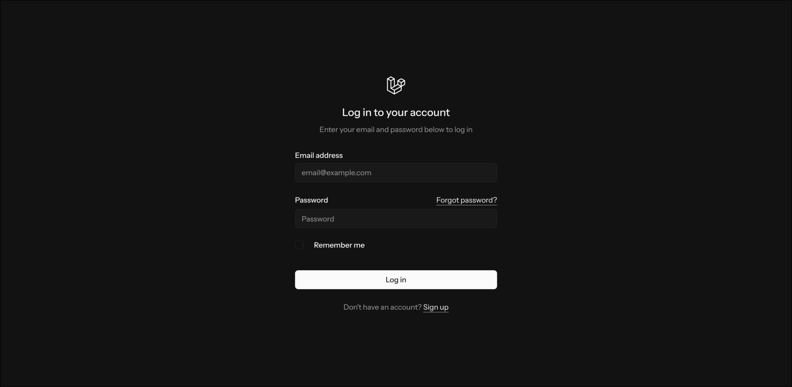
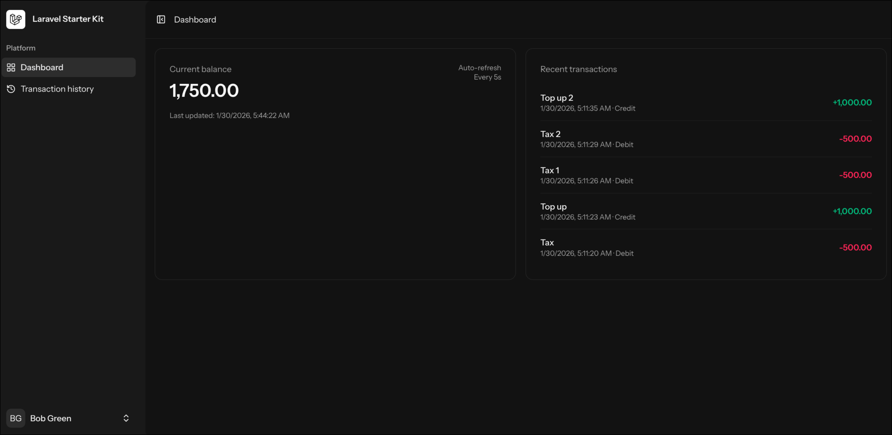
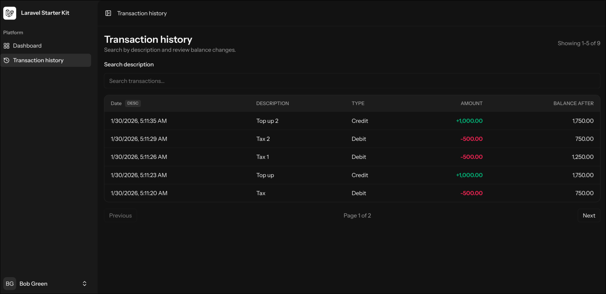

# Laravel starter pack (Vue) -> Балансы пользователей

## Запуск проекта
1. скопировать содержимое `.env.example`  в `.env`
2. `make up`
3. `make composer`
4. `make key`
5. `make migrate`
6. `make npm`
7. `make vite` (если видите ошибку про Vite manifest)
8. `make worker` для теста команд начисления

---

## Для тестов
`make test`

---

## Команды 

1. Создание пользователя `php artisan user:create "Bob Green" bob bob@gmail.com qwerty123`
2. Начислить баланс `php artisan balance:operate bob credit 1000 "First topup"`
3. Списать баланс `php artisan balance:operate bob debit 250 "Subscription"`

## Front

#### Авторизация

#### Главная авторизованного пользователя

#### История транзакций

